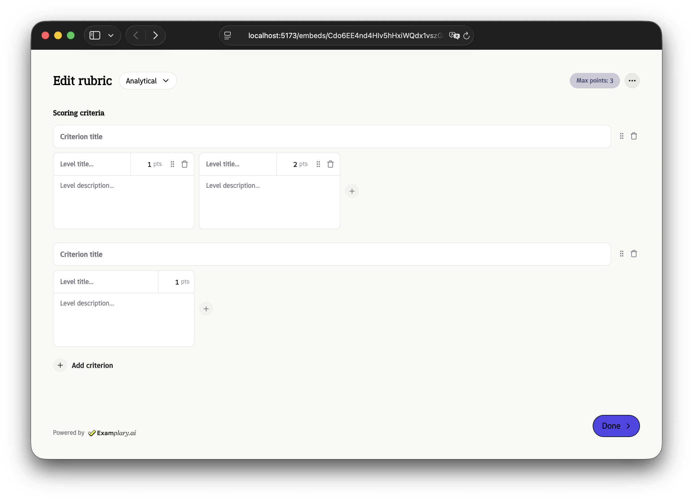

# Edit rubric flow

Examplary includes a rubric editor flow that allows users to create and edit rubrics for grading questions. You can embed this flow in your application to let users create their own rubrics, or edit existing ones.



### 1. Create an Examplary user for your user

To make sure we can save personal preferences and rubric templates created by the user to their specific account,
and can later allow them to reference these personal details, we require creating a user account in your workspace for each of your users.

```json title="POST /users"
{
  "email": "my-user@example.com",
  "name": "My User"
}
```

Store the returned user ID in your system to use with any future embed sessions for that user.

### 2. Create an embed session

Call the Examplary API to create a new embed session. You can configure presets for the rubric editor, as well as theme options.

The `actor` field should contain the ID of the Examplary user account you created for this customer.

You can either specify a `returnUrl` or an `allowedOrigin`, based on how you want to be notified when generation is completed.

```json title="POST /embed-sessions"
{
  "flow": "edit-rubric",
  "actor": "user_423r9j3r0jeddJA...",
  "presets": {
    "showDoneButton": true
  },
  "theme": {
    "primaryColor": "#4f46e5",
    "locale": "en"
  },
  "metadata": {
    "myUniqueIdentifier": "abc1234"
  },
  "returnUrl": "https://app.example.com",
  "allowedOrigin": "https://app.example.com"
}
```

This returns a response that looks like this:

```json
{
  "id": "embed_session_55S843D7HfNfs9RY48PoTprXnRcz2Vw8Crst64UYrBnz...",
  "status": "pending",
  "embedUrl": "https://app.examplary.ai/embeds/55S843D7HfNf...",
  "flow": "edit-rubric",
  "actor": "user_423r9j3r0jeddJA...",
  "enabledResponseModes": ["return_url", "post_message"],
  "createdAt": "2025-12-09T16:52:52.120Z",
  "expiresAt": "2025-12-16T16:52:52.120Z",
  "presets": {
    "showDoneButton": true
  },
  "outputs": {},
  "theme": {
    "primaryColor": "#4f46e5",
    "locale": "en"
  },
  "metadata": {
    "myUniqueIdentifier": "abc1234"
  }
}
```

### 3. Lead the user to the embed URL

You can either redirect the user directly to the URL, or display it in an `iframe`.

The latter might be better for the user experience, especially when displayed as a modal. This also allows you to listen to status updates in real time,
through the `postMessage()` API.

```ts
const embedUrl = "https://app.examplary.ai/embeds/55S843D7HfNf...";

iframe.src = embedUrl;

window.addEventListener("message", (event) => {
  // Make sure the message is coming from a trusted origin
  if (event.origin !== new URL(embedUrl).origin) return;

  // Handle the message
  const { type, status, outputs } = event.data;
  if (type === "examplary:embed-status-update") {
    console.log(status);

    if (status === "completed") {
      const rubric = outputs.rubric;
      console.log(
        "Rubric creation complete. You might want to hide the iframe now.",
        rubric,
      );
    }
  }
});
```

If you're using redirects, you can expect a redirect to your specified `returnUrl` with one of two query string parameters values:

- On success: `?status=completed&rubric={...}`

If neither of these options work for you, you may also poll the Examplary API for status updates:

```json title="GET /embed-sessions/{id}"
{
  "id": "embed_session_55S843D7HfNfs9RY48PoTprXnRcz2...",
  "flow": "edit-rubric",
  "status": "completed",
  "outputs": {
    "rubric": {
      // ...
    }
  }
  // ...
}
```

You can find the JSON schema for the rubric output [here](https://schemas.examplary.ai/question-scoring.json).

### 4. Cleanup

The embed session will expire automatically after 7 days, but because it gives some limited access to your account, you might want to remove it manually:

```
DELETE /embed-sessions/{embedSessionId}
```

You can also delete the generated exam once you don't need it anymore:

```
DELETE /exams/{examId}
```
