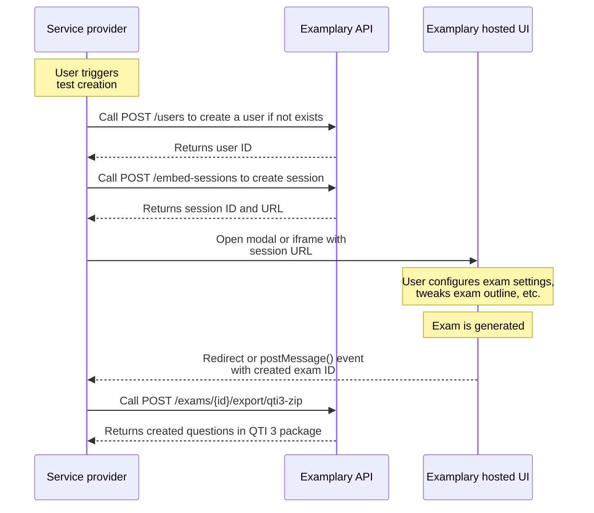

# Embed Sessions

Our platform makes it possible for other service providers to integrate parts of the Examplary experience within their products.
To make this possible, we offer the **Embed Sessions** API, which allows the service provider to get a unique link
to a part of the Examplary UI that can be embedded in their UI.

This makes it possible to integrate flows such as exam generation or question generation directly into your own application,
while still leveraging the full power of the Examplary platform.

## Supported flows

**Currently supported flows:**

- Exam generation flow (`generate-exam`)

**Coming soon:**

- Question generation flow (`generate-question`)

## Example flow

Example flow for exam generation using embed sessions:

## Getting started

To get started testing this flow, first create a free account on [app.examplary.ai](https://app.examplary.ai/register).

Find your API key in the [Developer settings](https://app.examplary.ai/account/developer) page.

Then, follow the instructions in the [exam generation flow](./exam-generation) document to create your first embed session.

Or have a look at the [live code example](https://examplary-ai.github.io/embed-sessions-demo/).