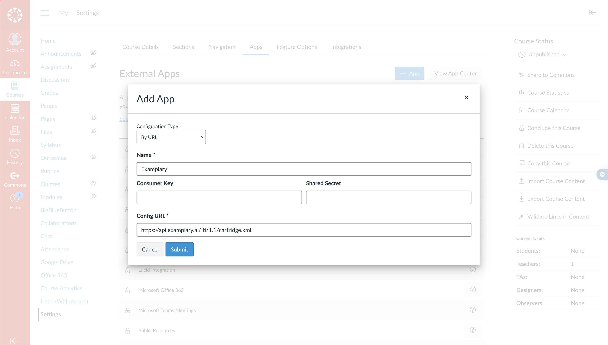
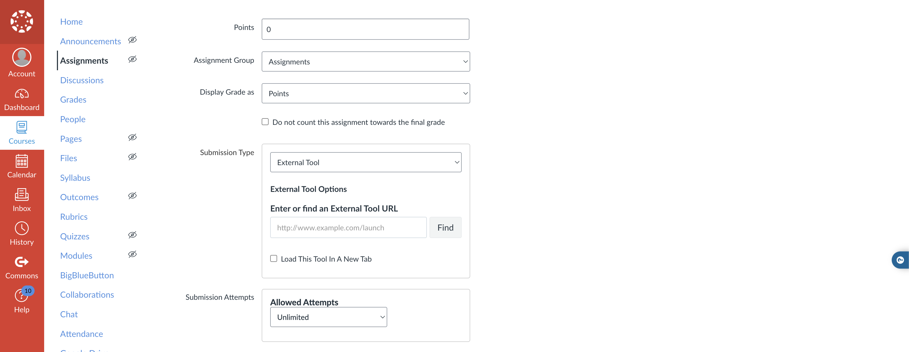
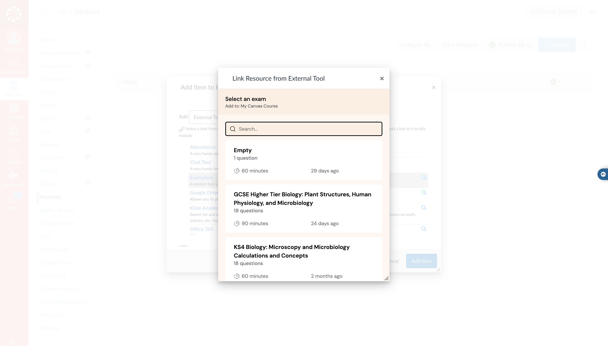

# Integrating with Canvas LMS

To use Examplary tests within Canvas LMS, you need to connect Examplary as an app.

You can do this either within your course, or across all of Canvas.

## Connecting to your course

1. Within your course settings, click **Apps**, followed by **View App Configurations**
2. Click the **Add app** button, and select **By URL**
3. Enter `Examplary` as the name, and the URL: `https://api.examplary.ai/lti/1.1/cartridge.xml`

## Selecting a resource

1. Create a new assignment in your course
2. In the assignment settings, find the **External Tool** section, click **Find** and select **Examplary** from the list of available tools

You'll then be able to select the test from Examplary you wish to use in your assignment. The same can be done within modules and links.

