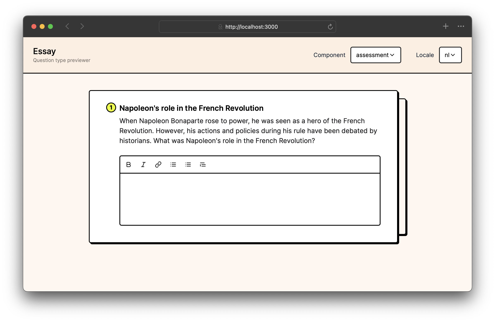

# Question type components

Examplary renders React components for each question type in various contexts.

You can implement components for the following views:

- `assessment`: The main view where users interact with the question, either by the student during the assessment, or by the teacher in the question editor preview window.
- `print`: A simplified view for printing the question, which is used in the print preview and when printing the assessment.
- `results`: Displaying the results of the question, during the teacher's review of the assessment.
- `settings-area`: Displaying custom settings for the question type in the question editor.

:::warning
Only use the `settings-area` component if you need to display custom settings for your question type that can't be covered using the standard settings described in the [metadata](./metadata) section.
:::

## Building and testing components

Components should be implemented as React components in JavaScript or TypeScript. You can use any React features, including hooks, context, and state management.

Here's a simple example of the `assessment` component in the `single-line-text` question type, written in JavaScript:

```jsx title="component-assessment.jsx"
import { RichTextField } from "@examplary/ui";

export default ({ answer, saveAnswer, t }) => {
  return (
    <RichTextField
      singleLine
      value={answer?.value || ""}
      placeholder={t("placeholder")}
      onChange={(value) => {
        const valid = value.trim().length > 0;
        saveAnswer({ value, completed: valid });
      }}
    />
  );
};
```

To aid in typing, you can write the same thing in TypeScript:

```tsx title="component-assessment.tsx"
import { FrontendAssessmentComponent, RichTextField } from "@examplary/ui";

const AssessmentComponent: FrontendAssessmentComponent = ({
  answer,
  saveAnswer,
  t,
}) => {
  return (
    <RichTextField
      singleLine
      value={(answer?.value as string) || ""}
      placeholder={t("placeholder")}
      onChange={(value) => {
        const valid = value.trim().length > 0;
        saveAnswer({ value, completed: valid });
      }}
    />
  );
};

export default AssessmentComponent;
```

## Testing locally

In your question type folder, you can use the Examplary CLI to preview your question type locally. Make sure a recent version of Node and NPM are installed, then run:

```bash
npx @examplary/cli preview
```

This will start a local server that serves your question type, allowing you to test it in various scenarios. The preview tool will automatically reload when you make changes to your components, so you can see the results immediately.



## Object types

### Question object

This represents the question itself, which is passed to the components as a prop. It contains metadata about the question type, such as its name, description, and settings.

It looks like this:

```json
{
  "id": "q_qQjXQasmUfpWRV5KO5mzkxoy",
  "title": "Napoleon's role in the French Revolution",
  "type": "single-line-text",
  "description": "When Napoleon Bonaparte rose to power, he was seen as a hero of the French Revolution. However, his actions and policies during his rule have been debated by historians. What was Napoleon's role in the French Revolution?",
  "settings": {
    "scoringCriteria": [
      {
        "description": "The answer must correctly identify Napoleon's role in the French Revolution and provide relevant historical context.",
        "points": 1
      }
    ]
  }
}
```

### Answer object

The answer object represents the student's answer to the question. It contains the following properties:

```json
{
  "value": "He was important because he was a general in the French army and later became the Emperor of France.",
  "completed": true,
  "context": {}
}
```

The `value` property contains the student's answer, which can be a string or an array of strings. The `completed` property indicates whether the answer is complete, and the `context` property can hold additional information relevant to the answer. The question type can define what this context should contain, but it is not required.

## Component props

### Assessment component props

| Prop         | Type                                   | Description                                                                                            |
| ------------ | -------------------------------------- | ------------------------------------------------------------------------------------------------------ |
| `question`   | [Question](#question-object)           | The question object, which contains metadata about the question type, such as its title and settings.  |
| `answer`     | [Answer](#answer-object)               | The current answer object, which may contain the student's answer and its completion status.           |
| `saveAnswer` | function                               | A function to save the answer. It takes an object with `value`, `completed` and `context` properties.  |
| `isPreview`  | boolean                                | Indicates whether the component is being rendered in a preview context (e.g., in the question editor). |
| `api`        | [API object](./api-access.md)          | An API client instance for making requests to the Examplary REST API.                                  |
| `t`          | [Translation function](./translations) | A function to access translations defined in `question-type.json`.                                     |

### Print component props

| Prop        | Type                                   | Description                                                                                           |
| ----------- | -------------------------------------- | ----------------------------------------------------------------------------------------------------- |
| `question`  | [Question](#question-object)           | The question object, which contains metadata about the question type, such as its title and settings. |
| `showBoxes` | boolean                                | Whether to show boxes for the student to write their answers down.                                    |
| `api`       | [API object](./api-access.md)          | An API client instance for making requests to the Examplary REST API.                                 |
| `t`         | [Translation function](./translations) | A function to access translations defined in `question-type.json`.                                    |

### Results component props

| Prop       | Type                                   | Description                                                                                           |
| ---------- | -------------------------------------- | ----------------------------------------------------------------------------------------------------- |
| `question` | [Question](#question-object)           | The question object, which contains metadata about the question type, such as its title and settings. |
| `answer`   | [Answer](#answer-object)               | The current answer object, which may contain the student's answer and its completion status.          |
| `api`      | [API object](./api-access.md)          | An API client instance for making requests to the Examplary REST API.                                 |
| `t`        | [Translation function](./translations) | A function to access translations defined in `question-type.json`.                                    |

### Settings area component props

| Prop         | Type                                   | Description                                                                                           |
| ------------ | -------------------------------------- | ----------------------------------------------------------------------------------------------------- |
| `question`   | [Question](#question-object)           | The question object, which contains metadata about the question type, such as its title and settings. |
| `settings`   | object                                 | The current settings for the question type, which can be modified by the user.                        |
| `setSetting` | function                               | A function to update a specific setting. It takes the setting ID and the new value as arguments.      |
| `api`        | [API object](./api-access.md)          | An API client instance for making requests to the Examplary REST API and uploading files.             |
| `t`          | [Translation function](./translations) | A function to access translations defined in `question-type.json`.                                    |
