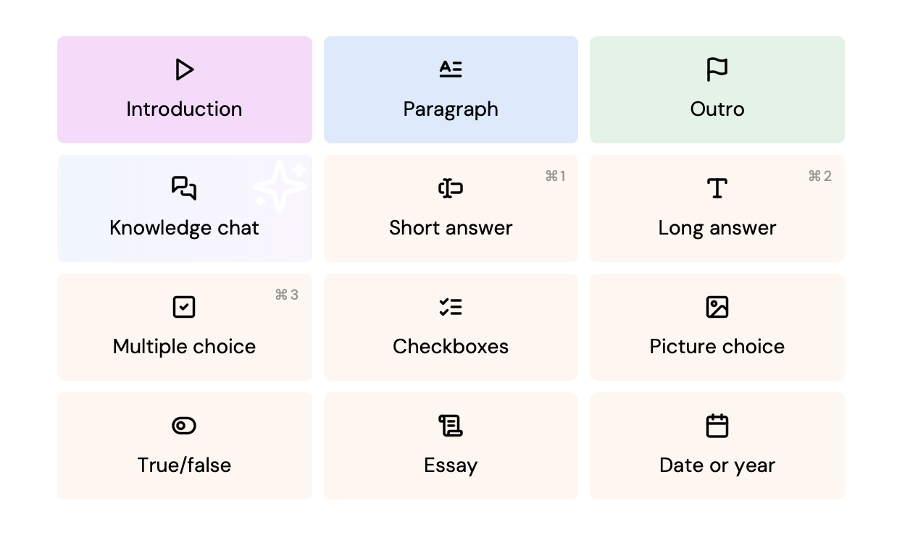
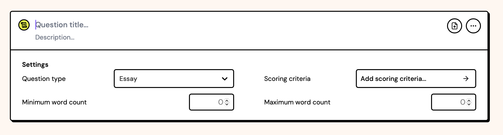

# Question type metadata

Here's an example of a `question-type.json` file as a starting point for your custom question type:

```json title="question-type.json"
{
  "$schema": "https://schemas.examplary.ai/question-type.json",

  "id": "examplary.default.single-line-text",
  "public": true,

  "name": {
    "en": "Short answer",
    "nl": "Kort antwoord"
  },
  "description": {
    "en": "A question that requires a short text response.",
    "nl": "Een vraag die een kort tekstantwoord vereist."
  },

  "icon": "./icon.svg",
  "components": {
    "assessment": "./component-assessment.tsx",
    "print": "./component-print.tsx"
  },

  "timeEstimateMinutes": 2,
  "generation": {
    "enabled": true
  },

  "shortcut": "1",

  "translations": {
    "placeholder": {
      "en": "Type your answer...",
      "nl": "Typ je antwoord..."
    }
  }
}
```

:::tip
Including the `$schema` property is optional. Editors like VSCode can use this schema to provide autocompletion and validation.
:::

## Translatables

Most of the fields that are displayed in the UI can be translated. The `name` and `description` fields are good examples of this. You are encouraged to provide translations for all supported languages.

If you don't want to translate the field yet, you can also use a simple string field:

```json
{
  "name": "Short answer"
}
```

## Name, description and icon

The `name` and `description` fields are used to display the question type in the UI. The `icon` field points to the SVG icon that represents the question type.

This SVG will be displayed in the question adder, and possibly in other places in the UI. Specifications:

- Displayed as a 24×24‑pixel icon
- Should either use `black` or `currentColor` as the only fill color

Most of the icons in the default question types are based on [Lucide icons](https://lucide.dev/). You can use these icons as a starting point for your own question type icons. We recommend a stroke width of 2.25px when exporting the SVG from the Lucide website.



## Components

The `components` field is an object that defines the React components used for different views of the question type. The keys are the view names, and the values are the paths to the component files.

Component files can be written in TypeScript or JavaScript, and should have a default export that is a React component. The component will receive the question data as props, which you can use to render the question in the specific view.

```json
{
  "components": {
    "assessment": "./component-assessment.tsx",
    "print": "./component-print.tsx"
  }
}
```

More information about the components can be found in the [components documentation](./components).

Questions without any components are allowed, but are only useful in specific cases (the default question types include 'paragraph', 'intro' and 'outro' which do not have any components). If you don't provide any components, the student can't interact with the question in the assessment view, but the title and description will still be displayed.

## Settings

Question types can have settings that are displayed in the question editor:



These settings are defined in the `question-type.json` file. Default fields 'question type' and 'scoring criteria'/'points' will always be present, but in this example the following were added:

```json
{
  "settings": [
    {
      "id": "minWords",
      "name": {
        "en": "Minimum word count",
        "nl": "Minimaal aantal woorden"
      },
      "type": "number",
      "placeholder": "0",
      "step": 50
    },
    {
      "id": "maxWords",
      "name": {
        "en": "Maximum word count",
        "nl": "Maximaal aantal woorden"
      },
      "type": "number",
      "placeholder": "0",
      "step": 50
    }
  ]
}
```

Each settings object can have the following fields:

| Field         | Type                           | Description                                                                                                                                                                                                                               |
| ------------- | ------------------------------ | ----------------------------------------------------------------------------------------------------------------------------------------------------------------------------------------------------------------------------------------- |
| `id`          | string                         | A unique identifier for the setting, used to store the value in the question data. This should be a valid JavaScript identifier.                                                                                                          |
| `name`        | [Translatable](#translatables) | The name of the setting, displayed in the UI.                                                                                                                                                                                             |
| `type`        | string                         | The type of the setting. See below.                                                                                                                                                                                                       |
| `helpText`    | [Translatable](#translatables) | Optional information for the user, shown as a tooltip on hover.                                                                                                                                                                           |
| `description` | string                         | An optional description for the setting, used exclusively for AI generation. Useful to specify the format of the values expected.                                                                                                         |
| `default`     | any                            | The default value for the setting. Must match the setting type.                                                                                                                                                                           |
| `options`     | array                          | An array of options for `enum` type settings. Each option should be an object with `value` and `label` fields, where `value` is the actual value stored in the question data, and `label` (Translatable) is the text displayed in the UI. |
| `placeholder` | [Translatable](#translatables) | A placeholder text for the input field, displayed when the field is empty.                                                                                                                                                                |
| `step`        | number                         | The step size for number inputs. Optional.                                                                                                                                                                                                |
| `min`         | number                         | The minimum value for number inputs. Optional.                                                                                                                                                                                            |
| `max`         | number                         | The maximum value for number inputs. Optional.                                                                                                                                                                                            |

The following settings types are supported:

- `enum` - A dropdown with a list of options. The `options` field is required.
- `boolean` - A checkbox/switch. The value will be `true` or `false`.
- `number` - A number input field. The `placeholder`, `step`, `min` and `max` fields are optional.
- `string` - A single-line text input field. The `placeholder` field is optional.

## Optional fields

These other fields are available in the `question-type.json` file:

| Field                     | Type                           | Description                                                                                                                 |
| ------------------------- | ------------------------------ | --------------------------------------------------------------------------------------------------------------------------- |
| `public`                  | boolean                        | If true, the question type will be available to all users. If false, it will only be available to the owner's organization. |
| `generation.enabled`      | boolean                        | If true, the question type can be automatically generated by the platform's AI exam generator.                              |
| `generation.instructions` | string                         | Optional additional AI instructions for generating questions of this type.                                                  |
| `grading.enabled`         | boolean                        | If true, the question type can be automatically graded by the platform's AI grading system.                                 |
| `grading.instructions`    | string                         | Optional additional AI instructions for grading questions of this type.                                                     |
| `timeEstimateMinutes`     | number                         | An estimate of the time required to answer the question, in minutes.                                                        |
| `translations`            | object                         | An object containing [translatable strings](./translations) for the question type, such as placeholders.                    |
| `isAi`                    | boolean                        | Specifies that this question type uses AI functionality within the question.                                                |
| `backgroundColor`         | string                         | A CSS color value for the background color of the question type in the UI.                                                  |
| `enforcePosition`         | "start" or "end"               | Specifies whether the question type should always be added at the start or end of the question list in an exam.             |
| `enforceTitle`            | [Translatable](#translatables) | Force questions of this type to always have a specific title.                                                               |
| `hideSettings`            | boolean                        | If true, question settings will not be displayed in the UI when editing a question of this type.                            |
| `isPreviewRefreshable`    | boolean                        | If true, the question preview shows a refresh button.                                                                       |
| `hasSimpleScoring`        | boolean                        | Removes the 'scoring criteria' setting, and instead lets the teacher pick points to award for this question.                |
| `titlePlaceholder`        | [Translatable](#translatables) | A placeholder for the title input field in the question editor.                                                             |
| `descriptionPlaceholder`  | [Translatable](#translatables) | A placeholder for the description input field in the question editor.                                                       |
| `untitledPlaceholder`     | [Translatable](#translatables) | A placeholder for untitled questions in the question editor.                                                                |

## Internal options

These options are available to default question types, but should not be used in custom question types:

| Field      | Type   | Description                                                                                                                                                                                            |
| ---------- | ------ | ------------------------------------------------------------------------------------------------------------------------------------------------------------------------------------------------------ |
| `shortcut` | string | A keyboard shortcut to quickly add this question type in the UI. This is a single character that will be used as a shortcut key, in addition to the platform's meta key (Ctrl on Windows, Cmd on Mac). |
| `index`    | number | The index of the question type in the question type list. This is used to determine the order in which the question types are displayed in the UI.                                                     |
