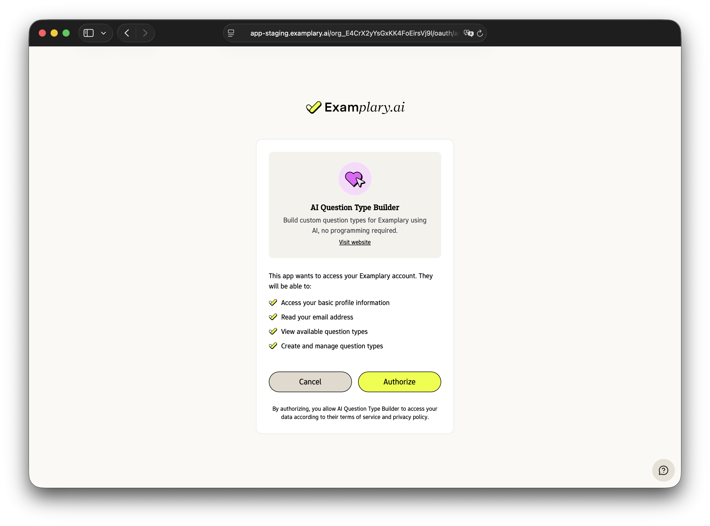

# Sign in with Examplary

Add "Sign in with Examplary" to your application and let users authenticate using their Examplary account. You can then access the Examplary API on behalf of your users with their permission.



Examplary supports OAuth 2.0 with the Authorization Code flow, with PKCE for enhanced security, and OpenID Connect for user authentication.

## Register your application

Before you can integrate OAuth, you need to register your application with Examplary:

1. Sign in to your Examplary account and navigate to **Account &rarr; Developers &rarr; Manage OAuth Clients**
2. Click **Create Client** and fill in your application details:
   - **Name**: Your application name (shown to users during authorization)
   - **Description**: A brief description of what your app does
   - **Redirect URIs**: The callback URLs where users will be redirected after authorization (one per line)
3. Click **Save** and copy your **Client Secret** — this is shown only once!
4. Store both your **Client ID** and **Client Secret** securely

## Implement the OAuth flow

Here's how to add "Sign in with Examplary" to your application:

### 1. Send users to authorize

When a user wants to sign in, redirect them to the authorization endpoint:

```
https://api.examplary.ai/oauth/authorize?response_type=code&client_id=YOUR_CLIENT_ID&redirect_uri=YOUR_REDIRECT_URI&scope=openid+profile+email&state=RANDOM_STATE
```

**Parameters:**

- `response_type`: Always `code` for the authorization code flow
- `client_id`: Your OAuth client ID
- `redirect_uri`: Where to send users after authorization (must match one of your registered URIs)
- `scope`: Space-separated list of scopes you're requesting
- `state`: A random string to prevent CSRF attacks — verify this matches when the user returns

### 2. User authorizes your app

The user will see a screen asking them to approve or deny access to your application.
They'll see which permissions (scopes) you're requesting.

### 3. Handle the callback

After the user authorizes your app, they'll be redirected back to your `redirect_uri` with a code:

```
https://your-app.com/callback?code=oauth_code_abc123&state=RANDOM_STATE
```

Verify that the `state` parameter matches what you sent in step 1.

### 4. Exchange the code for tokens

Make a POST request to exchange the authorization code for an access token:

```bash
curl -X POST https://api.examplary.ai/oauth/token \
  -H "Content-Type: application/json" \
  -d '{
    "grant_type": "authorization_code",
    "code": "oauth_code_abc123",
    "redirect_uri": "https://your-app.com/callback",
    "client_id": "oauth_client_xyz",
    "client_secret": "oauth_secret_xyz"
  }'
```

You'll receive a response like this:

```json
{
  "access_token": "oauth_access_xyz123",
  "token_type": "Bearer",
  "expires_in": 86400,
  "refresh_token": "oauth_refresh_abc456",
  "scope": "openid profile email",
  "user_id": "user_789",
  "org_id": "org_456",
  "id_token": "eyJhbGciOiJIUzI1NiIsInR5cCI6IkpXVCJ9..."
}
```

- **access_token**: Use this to make API requests (valid for 24 hours)
- **refresh_token**: Use this to get a new access token when it expires (valid for 30 days)
- **id_token**: JWT containing user information (only included if you requested the `openid` scope)
- **user_id** and **org_id**: Identifiers for the authenticated user and their organization

### 5. Make API requests

Include the access token in the Authorization header when making API requests:

```bash
curl https://api.examplary.ai/me \
  -H "Authorization: Bearer oauth_access_xyz123"
```

### 6. Refresh expired tokens

When your access token expires, use the refresh token to get a new one:

```bash
curl -X POST https://api.examplary.ai/oauth/token \
  -H "Content-Type: application/json" \
  -d '{
    "grant_type": "refresh_token",
    "refresh_token": "oauth_refresh_abc456",
    "client_id": "oauth_client_xyz",
    "client_secret": "oauth_secret_xyz"
  }'
```

## Revoking tokens

Users can revoke access to your application at any time from their account settings. When a token is revoked, it can no longer be used to make API requests.

You can also programmatically revoke tokens by making a POST request to the revoke endpoint:

```bash
curl -X POST https://api.examplary.ai/oauth/revoke \
  -H "Content-Type: application/json" \
  -d '{
    "token": "oauth_access_xyz123",
    "client_id": "oauth_client_xyz",
    "client_secret": "oauth_secret_xyz"
  }'
```
